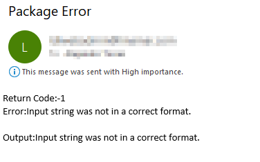

# SSIS: How to read error messages from a console app and send them by email
Let's say you have a SSIS package that runs a console app, everything works fine, but one day, the console app fails, and the SSIS package fails with a non helpful error message. You want to know what was the error, what data was involved and you want it be email
## Works with
* SSIS project in Visual Studio 2015
* Simple console app in .NET 4.8
### Steps
#### Console app
1. Create a console app for C#
2. Replace the code in Program.cs with this:
   ```csharp
    class Program
    {
        static int Main(string[] args)
        {
            try
            {
                string value = "a";
                //Output to StdOutput variable
                Console.WriteLine("Value to convert:" + value);
                int i = int.Parse(value);
                return 0; //In console apps, normally returning 0 indicates success
            }
            catch (Exception ex)
            {
                //Output to StdError variable
                Console.Error.WriteLine(ex.Message);
                return -1; //Returning any value different than 0 might indicate failure or some other condition
            }
        }
    }
   ```
    In this program we're doing the following
    * Writing data to the console
    * Deliberately throwing an error by trying to cast a letter to a number
    * Catching the exception, writing the error to the console and returning -1
3. Build the project
   
#### SSIS
1. Create an SSIS package
2. Add the following variables
   * ***ReturnCode (int32)*** - Returns the code number from the ***Main*** function in the console app, this number could be 0 for success or -1 for error;
   * ***StdError (String)*** - Stores anything printed out with ***Console.Error.WriteLine(...)*** in the console app
   * ***StdOutput - String*** - Stores anything printed out with ***Console.WriteLine(...)*** in the console app
  
   
3.  and add an ***Execute Process Task*** to the ***control Flow***
   
4. Right click the element and select ***Properties***
5. Configure properties like this:
   * Executable: Browse the consola app.exe, should be something like `C:\...\ConsoleApplication1\bin\debug\ConsoleApplication1.exe`
   * ExecValueVariable: ***ReturnCode*** variable
   * FailPackageOnFailure: False
   * FailParentOnFailure: False
   * StandardErrorVariable: ***StdError*** variable
   * StandardOutputVriable: ***StdOutput*** variable
   * WorkingDirectory: The folder of `ConsoleApplication1.exe`, should be something like `C:\...\ConsoleApplication1\bin\debug\`
<br>
    *Changes are highlighted:*
      
6. Add a ***Send Mail Task*** element
7. Connect the ***Execute Process Task*** to the ***Send Mail Task***
8. Double click the green arrow
9. In Constraint options, set Value = "Failure"
   
10. Click OK
11. Double click ***Send Mail Task*** and configure it like this:
    * ***SMTP Connection*** - click *\<New connection\>* and configure your SMTP manager
    * ***From*** - An email account to send emails
    * ***To*** - A destination account
    * Specify a subject
    * ***Message Source*** - Don't write anything
    
12. In the same window, click ***Expressions***
13. Add an expression for ***MessageSource***
    ```vb
    "Return Code:" + (DT_WSTR, 4)@[User::ReturnCode] + "\r\n" + "Error:" + @[User::StdError] + "\r\n" + "Output:" +  @[User::StdOutput]
    ```
       
14. Click OK
15. Run the package
    * ***Execute Process Task*** should fail
    * ***Send Mail Task*** should succeed
        
16. Check you email
    

## Resources        
* [Executing your own .NET console application from SSIS (more complete example)](https://www.sqlshack.com/executing-net-console-application-ssis/)
## Download source code
* https://github.com/atorres16/SSIS-read-error-console-app-mail.git